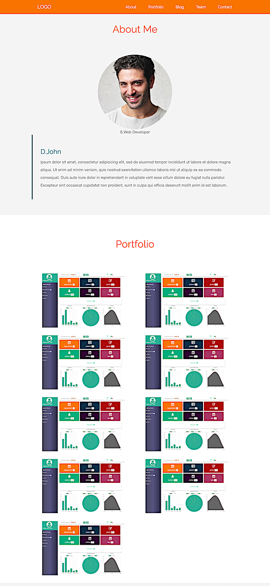
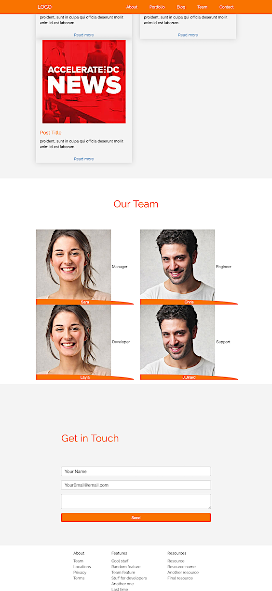
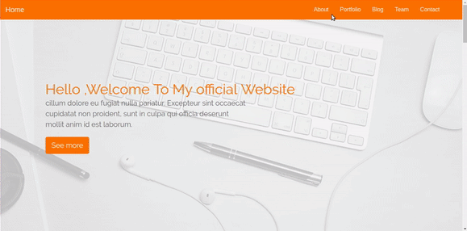

# Aurora

## A single page website for learning Bootstrap 4

---

## Updated version

### Laundry list of fixes and enhancements

1. Fixed issues in the header and footer.
1. Added custom flexbox classes to center the contact and footer sections.
1. Center justified the blog card **Read more**.
1. Made the top nav fixed and added offset margin to the header to avoid unwanted cropping of the hero image.
1. Added alternating background colours to the sections to break up the monochrome look and feel.
1. Added custom JavaScript to the hero CTA for smooth scrolling to the about section. The JavaScript also pushes the `#about` URL to the browser history and updates the address bar.
1. Changed the portfolio, blog, and team sections to break into nx2 layouts instead of nx1 for mobile.
1. Fixed the stretched out blog preview images.
1. Fixed the team overlay to be flush on desktop and mobile.

### Screengrabs

---

## Original version

The original version is available in this [repo on GitHub](https://github.com/hayanisaid/bootstrap4-website).

See the article [Learn Bootstrap 4 in 30 minutes by building a landing page website](https://www.freecodecamp.org/news/learn-bootstrap-4-in-30-minute-by-building-a-landing-page-website-guide-for-beginners-f64e03833f33/) on freedCodeCamp.

