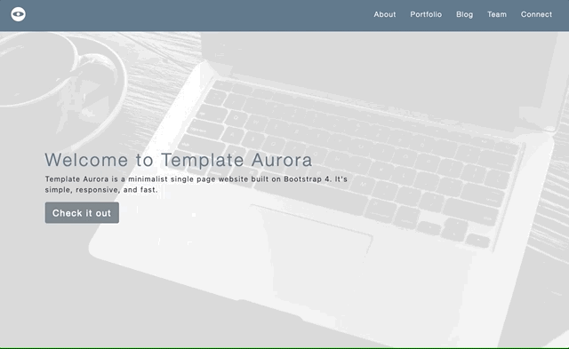
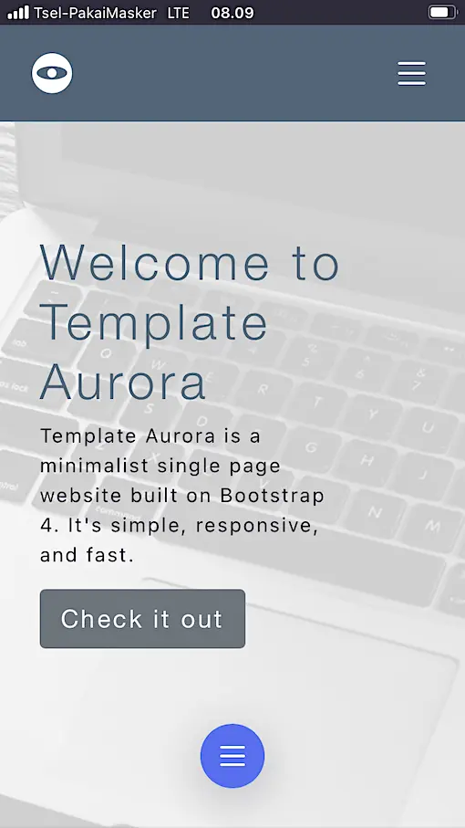
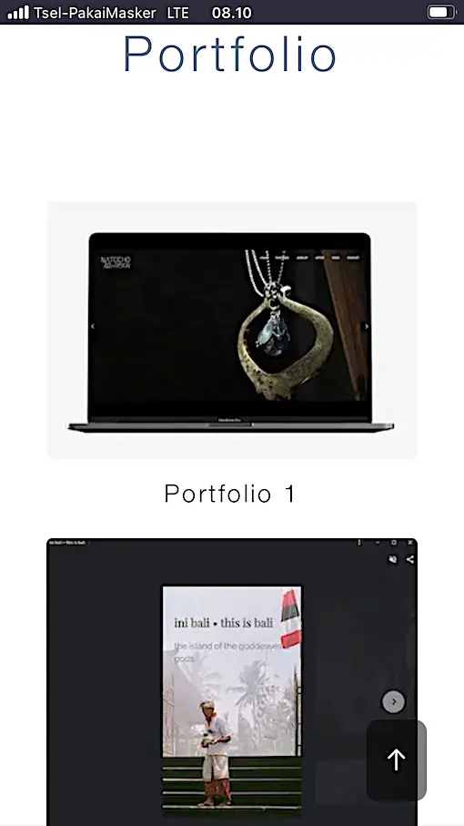

# Template Aurora

## A single page website template built on Bootstrap 4

Template Aurora is a minimalist single page website built on Bootstrap 4. It's simple, responsive, and fast. 

---

## About

Template Aurora is a single page static website designed to get you a clean and professional website in less time. With Aurora, you get a mobile-first designed website right out of the box. That's right—mobile design isn't an afterthought when it comes to Aurora!

The template's clean aesthetic and responsive design makes heads turn and loads fast and on any device. The hero image uses responsive art directed images to improve your above-the-fold page speed and keep your hero looking great on mobile.

The markup code is formatted and organised using HTML5 semantic tags. This means you save time and improve quality by knowing where to drop in your content. All the custom CSS lives in a central file and uses BEM notation (for you CSS3 geeks) to make adding your own styles a breeze. 

---

## Change summary

### Laundry list of fixes and enhancements

1. Fixed issues in the header and footer.
1. Added CSS variables to support changing the template's colours.
1. Added custom flexbox classes to center the contact and footer sections.
1. Center justified the blog card **Read more**.
1. Made the top nav fixed and added offset margin to the header to avoid unwanted cropping of the hero image.
1. Added alternating background colours to the sections to break up the monochrome look and feel.
1. Added custom JavaScript to the hero CTA for smooth scrolling to the about section. The JavaScript also pushes the `#about` URL to the browser history and updates the address bar.
1. Changed the portfolio, blog, and team sections to break into nx2 layouts instead of nx1 for mobile.
1. Fixed the stretched out blog preview images.
1. Fixed the team overlay to be flush on desktop and mobile.
1. Fixed mobile menu not closing when clicked (jQuery).
1. Removed overlay and animation for team section.
1. Changed team to card layout.
1. Added bottom margin on cards for mobile.
1. Adjusted top spacing for hero text on mobile.
1. Began using mobile first CSS.
1. Started using [BEM for CSS](http://getbem.com/naming/).
1. Added mobile-first art directed hero images for RWD.
1. Migrated all images to WebP.
1. Added cme dev To Top button.

### Screengrabs

---

## Credits

Images by [caught my eye](https://www.caughtmyeye.cc/). Placeholder words by [Hipster Ipsum](https://hipsum.co/). Lazy load by [ImageKit.io](https://imagekit.io/).
